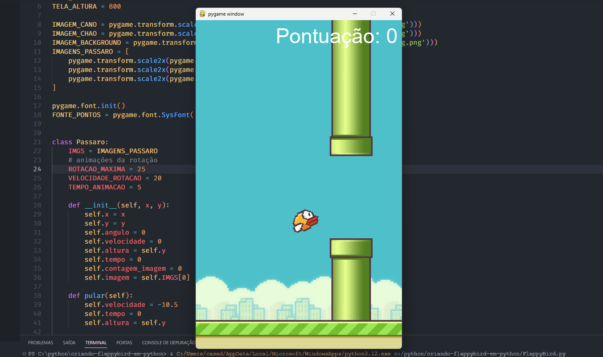

# Replicando o jogo Flappy Bird com Python

Neste breve curso, adquiri conhecimentos sobre o desenvolvimento de jogos e explorei diversas bibliotecas de Python utilizadas nesse contexto.

Url do mini-curso: https://pages.hashtagtreinamentos.com/minicurso-python-criacaojogos-obrigado

## Tópicos.

- Configurações iniciais
- Parâmetros do jogo
- Objetos do jogo e inicializando o pássaro
- Funções de pula e mover o pássaro
- Criando o Cano
- Mover, desenzar e colidir o cano
- Criando o chão
- Função principal -  criação e interaçvão com o usuário
- Finalização a função principal - movimentação dos objetos
- Execução, corrigndo bugs e finalizando o projeto

## Bibliotecas necessárias para rodar.

Versão do python: 3.12.1

```
pip install import pygame
```
```
pip install os
```
```
pip install random
```